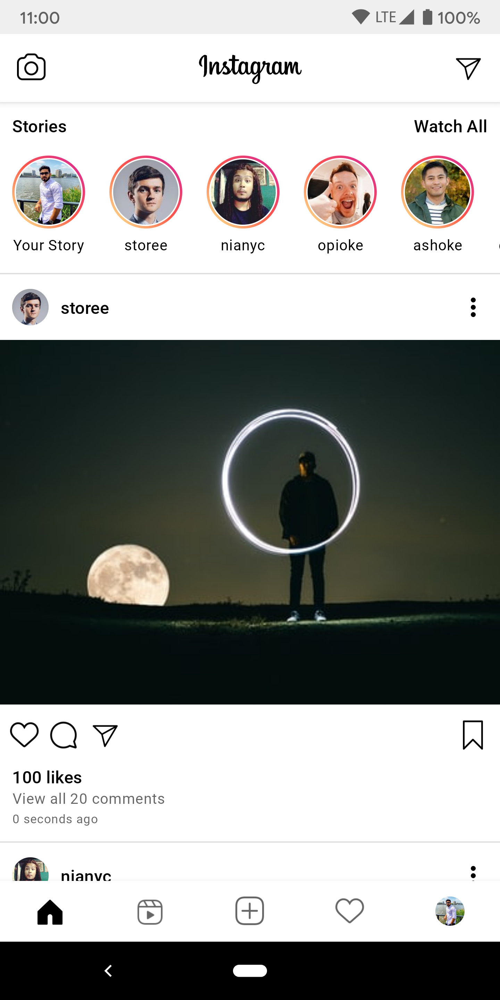
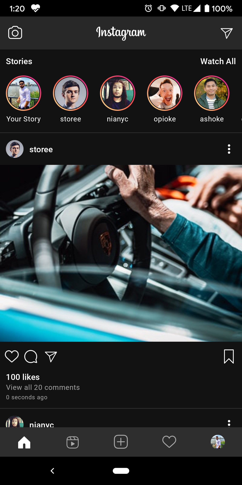

# JetInstagram

JetInstagram is an instagram clone app built with [Jetpack Compose][compose].

This sample showcases:

* Home Screen
* Post Like Button Animation
* Photo Like Animation
* Reels
* Playing Video with [Exoplayer][exoplayer] in Compose Environment

<p float="center">
  
  
  
</p>

JetInstagram is still under development and some screens are not yet implemented.

Libraries:
* Compose Toolkit
* [Coil][coil]
* [Exoplayer][exoplayer]
* Kotlin Coroutines

[compose]: https://developer.android.com/jetpack/compose
[coil]: https://coil-kt.github.io/coil/compose
[exoplayer]: https://github.com/google/ExoPlayer


## License

```
Copyright 2020 Vipul Asri

Licensed under the Apache License, Version 2.0 (the "License");
you may not use this file except in compliance with the License.
You may obtain a copy of the License at

    https://www.apache.org/licenses/LICENSE-2.0

Unless required by applicable law or agreed to in writing, software
distributed under the License is distributed on an "AS IS" BASIS,
WITHOUT WARRANTIES OR CONDITIONS OF ANY KIND, either express or implied.
See the License for the specific language governing permissions and
limitations under the License.
```

